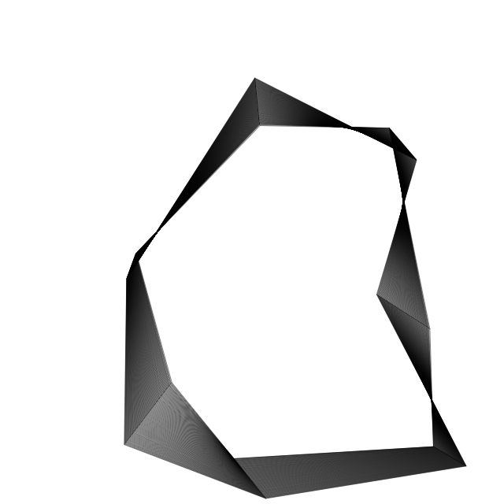
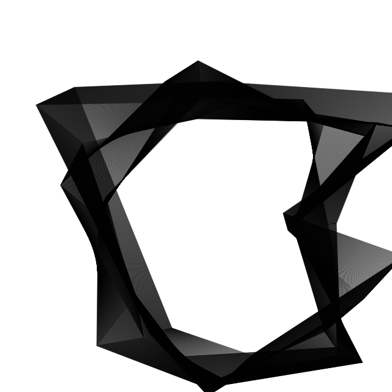
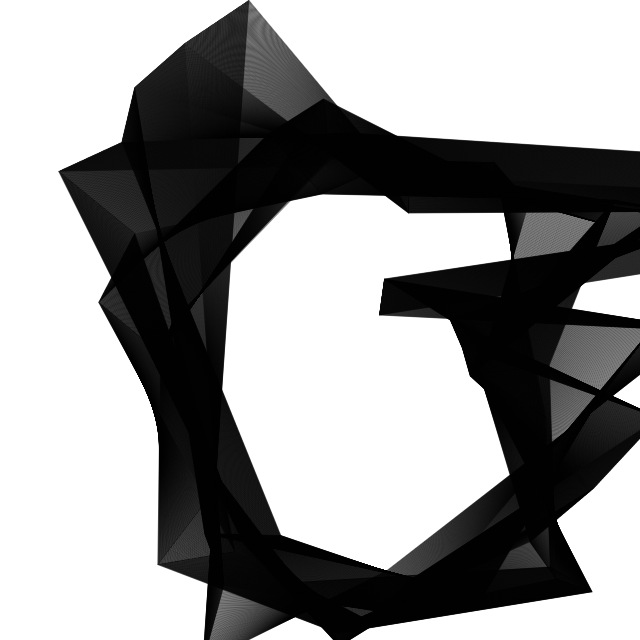
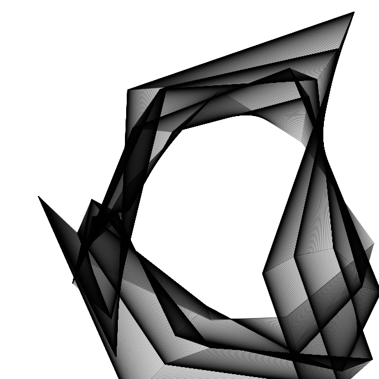
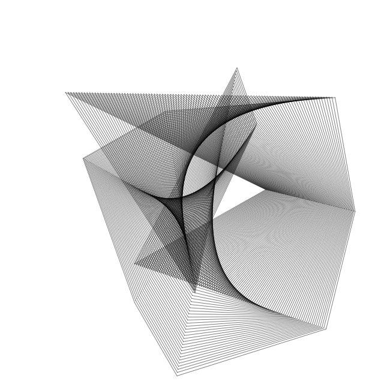
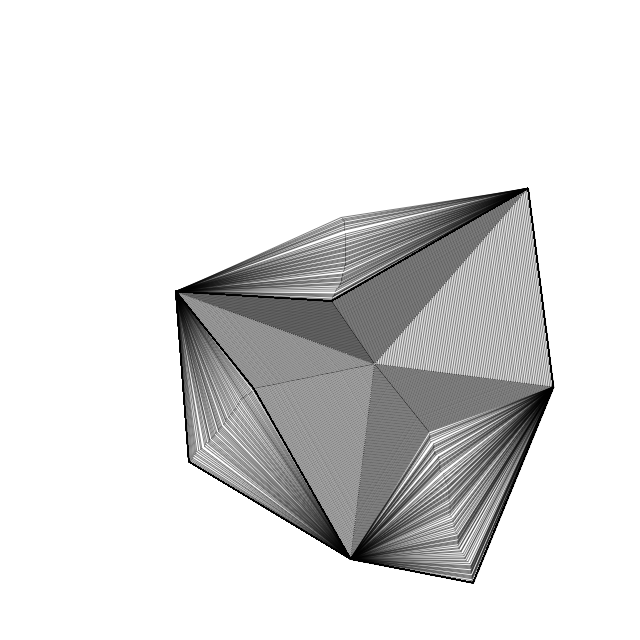

A Generative 2D Mesh Tweening Test (II)
======================================

Written in Javascript (with HTML5 Canvas).

Demo at http://www.int2byte.de/public/generative-mesh-tween/main.html
