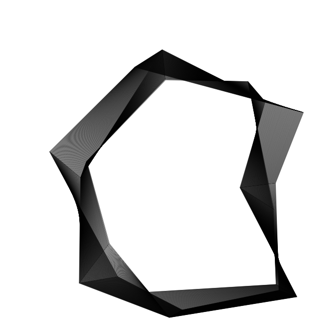

A Generative 2D Mesh Tweening Test (II)
======================================

Written in Javascript (with HTML5 Canvas).

Demo at http://www.int2byte.de/public/generative-mesh-tween/main.html

Note: The application has timing issues as it does not use the requestAnimationFrame API.
      On slow systems the graphics may render with gaps (time gaps = graphic gaps).
      I'm still trying to solve this but I am afraid the tweening enginge does not support
      this.
      Maybe it's time for a new basic tweening class.
      